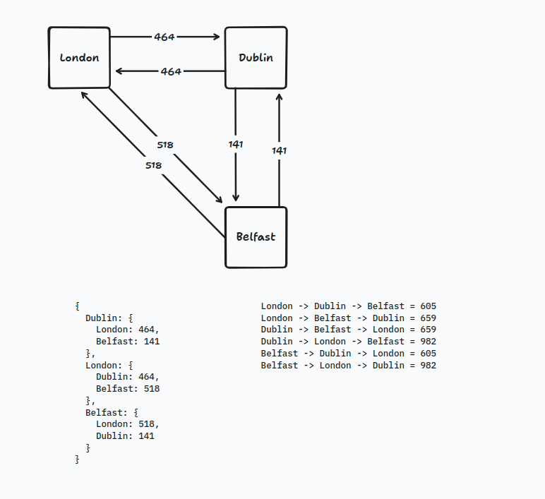

# 2015 day 09

Visualization:

The strategy behind my algorithm is just make a search always taking into account the greatest/smallest distance.

## The algorithm

I tried to use some strategies that I'm studying a bit more, like regex.

RegEx always is treated like "when I need I'll search for it", but, nowadays I'm trying to learn more about this, cause I know
it's very powerfull. A great example of this is the [Eliza](https://en.wikipedia.org/wiki/ELIZA_effect) chat bot by [Joseph Weizenbaum](https://en.wikipedia.org/wiki/Joseph_Weizenbaum),
that uses no math concepts, no neural networks, only regex and some simple algorithms.

So, instead of just doing a split by spaces (Like I did the first try), I opted for use RegEx to define a "Syntax" to the route.
This way, the user is not restricted to the following format `<Origin> to <Destination> = <Distance>`,
but he can use the following **pattern** `<Origin> to <Destination> = <Distance>`.

It means, that the user can specify like `  <Origin>        to                        <Destination>=            <Distance>   `, and it will just work, cause it matches the pattern.

But, the user can't specify like: `<Origin> <Destination> = <Distance>`, cause it's missing the `to`, so it does not match the pattern.
