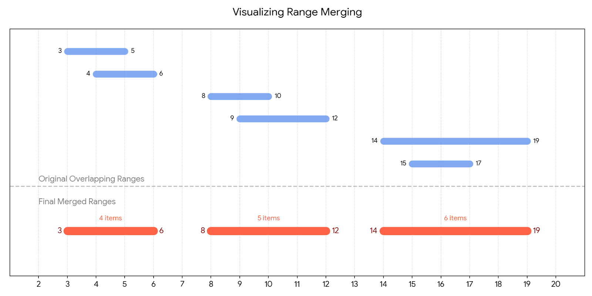

# Explaining the algorithm

```python
f = ingredient_ranges[0][0]
t = ingredient_ranges[0][1]

for i in range(1, len(ingredient_ranges)):
    nxt = ingredient_ranges[i]

    if nxt[0] <= t:
        t = max(t, nxt[1])
    else:
        all_fresh_ingredients += t - f + 1

        f = nxt[0]
        t = nxt[1]

all_fresh_ingredients += t - f + 1
```

Basically we keep increasing the range size until the origin of the next item does not overlap
with the destination of the current one.

**It's important to note that this logic only works because I sorted the array in the part one of the challenge**


